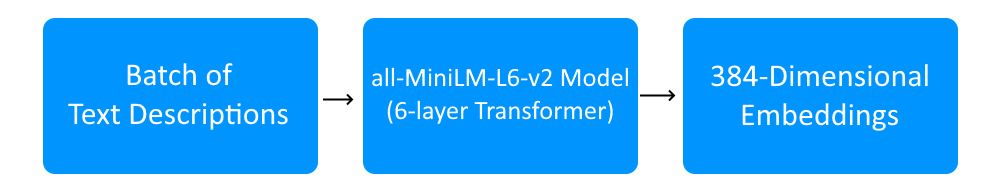
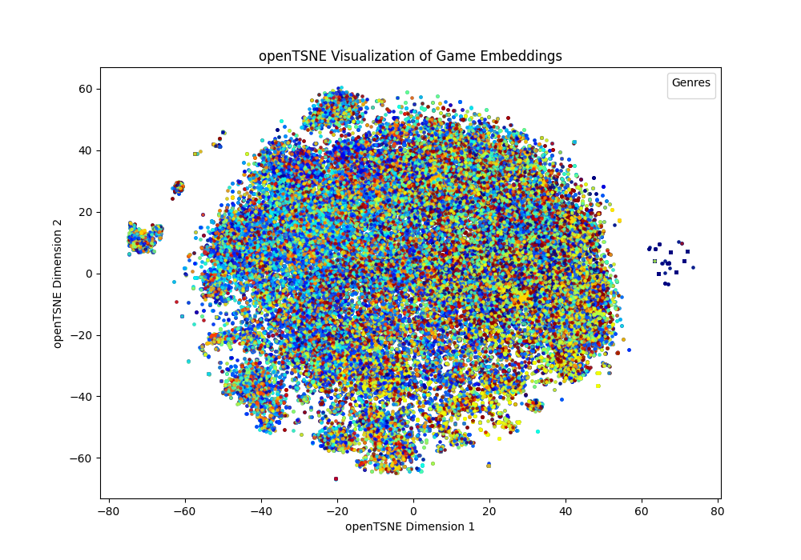
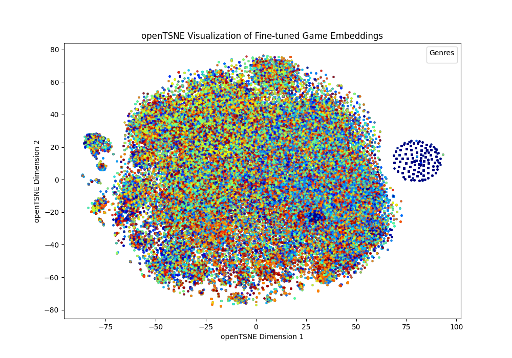

# Steam Game Recommendation System

This project aims to create a recommendation system for games available on Steam. It uses FastAPI, vectorizes and processes data to recommend games based on user-written queries.

The system may be used for finding good deals, searching for games by similar characteristics, comparing prices, and more.

All data used is taken from the [Steam Games Dataset](https://www.kaggle.com/datasets/fronkongames/steam-games-dataset?select=games.json) by Martin Bustos on Kaggle.

## Installation

Assuming you have Python installed:

1. On a command prompt or Powershell, clone the repository:

```
git clone https://github.com/gustavolp1/games-recommendation-api
```

2. Switch the directory to the newly-cloned repository:

```
cd games-recommendation-api
```

3. (Recommended) Create a virtual environment and activate it:

```
python -m venv env
.\env\Scripts\Activate.ps1
```

4. Install the required dependencies:

```
pip install -r "requirements.txt"
```

## Running and usage

Run `pretrained_embeddings.py` to generate embeddings and run TSNE. You may also run `finetuned_embeddings.py` to generate embeddings for the fine-tuned model.

Then, run `app.py`. This will initialize the server and automatically download a json with the data, if it has not been previously installed.

To send a query, use the following route (or the route specified on the terminal output):

```
http://10.103.0.28:2909/query?query=yourqueryhere
```

Where "yourqueryhere" should be replaced with a keyword related to your search.

This should output a json object with the following format:

```
{
  "results": [
    {
      "name": "A Cool Video Game",
      "price": 9.99,
      "release_date": "Jan 1, 2020",
      "developers": [
        "Bintendo"
      ],
      "genres": [
        "Adventure",
        "Action"
      ],
      "detailed_description": "This is a description of a video game.",
      "relevance": 0.235433
    },
    // more results, if the query yielded more than one
  ],
  "message": "OK"
}

```

A maximum of 10 results (the most relevant) will be received at a time, with a relevance value appended to it.

## Dataset Description

The dataset used for this project was the Steam Games Dataset by Martin Bustos. It contains web-scraped information on over 97 thousand games from the online game store Steam. Each entry contains information such as the game's name, price in American dollars, release date, developers, genres, descriptions and more.

## Embedding Generation

The embedding generation uses the all-MiniLM-L6-v2 model from SentenceTransformer. It is an efficient variant of the BERT architecture. This model processes the text into a 384-dimensional vector.

The high-dimensional space enables comparisons between games from cosine similarity. A batch size of 32 was used for memory management, due to the dataset's size. Games were classified based on their descriptions.



## Training Process

This model is trained with a Contrastive Loss function. It minimizes the distance between embeddings of similar pairs, while maximizing the distance between less similar ones. This is relevant for the task due to its ability to capture semantic similarity, which is useful for finding related games.

$$
\text{Loss} = \frac{1}{N} \sum_{i=1}^{N} \left[ y_{i} \cdot \text{d}(x_{i}^{1}, x_{i}^{2}) + (1 - y_{i}) \cdot \max(0, \text{margin} - \text{d}(x_{i}^{1}, x_{i}^{2})) \right]
$$

Where:

- y_i is 1 for similar pairs, 0 for dissimilar pairs.
- d(x_i^1, x_i^2) is the distance between embeddings.
- *margin* is the separation for dissimilar pairs.

## Visualizing Embeddings

OpenTSNE was run to project the embeddings on to a three-dimensional space. One was done on a pre-trained model, and the other on a fine-tuned model. This can be replicated by running `pretrained_embeddings.py` and `finetuned_embeddings.py` respectively. Below are the achieved results.

### Pre-Trained Embeddings



This figure shows embeddings generated with a pre-trained model. Each point represents a game description, with colors indicating genre. Points do not form clear clusters, which suggests this model captures semantic information but without much genre differentiation.

### Fine-Tuned Embeddings



This figure shows embeddings generated with the same model but fine-tuned. A slight concentration of points of the same color appears on the right, which suggests minor clustering. However, clusters are still not clear, which indicates that fine-tuning was not too helpful for separating genres.

### Conclusion

Neither version of the model formed distinct clusters. This could reflect limitations of the model, such as struggling to differentiate game genres from description alone. Fine-tuning did help with clustering slightly, though further enhancements are needed to improve this.

## Query examples

*(Note that the "detailed_description" field was manually removed for conciseness.)*

- A query that yields more than 10 results:

```
http://10.103.0.28:2909/query?query=action
```

```
{
  "results": [
    {
      "name": "Bug Dolls: Soviet Project",
      "price": 7.49,
      "release_date": "Aug 2, 2022",
      "developers": [
        "AK Studio"
      ],
      "genres": [
        "Action",
        "Adventure"
      ],
      "relevance": 0.517686367034912
    },
    {
      "name": "Six F and Six 0",
      "price": 0,
      "release_date": "Mar 12, 2021",
      "developers": [
        "うどんぱ"
      ],
      "genres": [
        "Action",
        "Adventure",
        "Free to Play",
        "Indie"
      ],
      "relevance": 0.48006671667099
    },
    {
      "name": "GALAXY MONSTER",
      "price": 7.99,
      "release_date": "Apr 5, 2019",
      "developers": [
        "Small Games"
      ],
      "genres": [
        "Action",
        "Indie"
      ],
      "relevance": 0.479524075984955
    },
    {
      "name": "ARATAMAKAMI",
      "price": 5.59,
      "release_date": "Feb 1, 2024",
      "developers": [
        "Recent Past"
      ],
      "genres": [
        "Action",
        "Indie",
        "RPG"
      ],
      "relevance": 0.457899689674377
    },
    {
      "name": "Project Lounge",
      "price": 0.99,
      "release_date": "Jul 9, 2021",
      "developers": [
        "Aivaras Ivoškus"
      ],
      "genres": [
        "Casual",
        "Indie"
      ],
      "relevance": 0.45190617442131
    },
    {
      "name": "CAPTAIN STARONE",
      "price": 8.99,
      "release_date": "Oct 19, 2022",
      "developers": [
        "Marumittu Games",
        "ESQUADRA,inc."
      ],
      "genres": [
        "Casual",
        "Indie"
      ],
      "relevance": 0.448765099048615
    },
    {
      "name": "Quest Action 3D",
      "price": 4.24,
      "release_date": "Jan 16, 2023",
      "developers": [
        "Aleksey"
      ],
      "genres": [
        "Action",
        "Adventure",
        "Casual",
        "Simulation"
      ],
      "relevance": 0.444800317287445
    },
    {
      "name": "Axiom Verge",
      "price": 19.99,
      "release_date": "May 14, 2015",
      "developers": [
        "Thomas Happ Games LLC"
      ],
      "genres": [
        "Action",
        "Adventure",
        "Indie"
      ],
      "relevance": 0.438246726989746
    },
    {
      "name": "The Bastonnes",
      "price": 5.99,
      "release_date": "Jun 13, 2022",
      "developers": [
        "Hibo Studios"
      ],
      "genres": [
        "Action",
        "Strategy",
        "Early Access"
      ],
      "relevance": 0.436203390359879
    },
    {
      "name": "Revertia",
      "price": 3.99,
      "release_date": "Feb 7, 2021",
      "developers": [
        "KamiCraft"
      ],
      "genres": [
        "Action",
        "Indie"
      ],
      "relevance": 0.435087293386459
    }
  ],
  "message": "OK"
}
```

Due to how popular action-oriented games are, alongside the word being frequently used on descriptions, it should show multiple results.

- A query that yields less than 10 results (no longer the case, after the APS2 iteration):

```
http://10.103.0.28:2909/query?query=relevancy
```

```
{
  "results": [
    {
      "name": "The Four Colour Theorem",
      "price": 0.99,
      "release_date": "Mar 26, 2018",
      "developers": [
        "Jon Pennant"
      ],
      "genres": [
        "Casual",
        "Indie"
      ],
      "relevance": 0.503412425518036
    },
    {
      "name": "Super Retro Retry",
      "price": 3.99,
      "release_date": "Dec 4, 2023",
      "developers": [
        "NetDancer Games"
      ],
      "genres": [
        "Action",
        "Casual",
        "Indie"
      ],
      "relevance": 0.469108194112778
    },
    {
      "name": "Climb",
      "price": 0.99,
      "release_date": "Jul 29, 2020",
      "developers": [
        "Travis Biancardi"
      ],
      "genres": [
        "Casual",
        "Indie"
      ],
      "relevance": 0.460516095161438
    },
    {
      "name": "Fall Down",
      "price": 0.99,
      "release_date": "Apr 30, 2018",
      "developers": [
        "Kadir Demiroğlu"
      ],
      "genres": [
        "Casual",
        "Indie"
      ],
      "relevance": 0.45303812623024
    },
    {
      "name": "Just Get There",
      "price": 5.99,
      "release_date": "Feb 20, 2024",
      "developers": [
        "Filip Stachowiak"
      ],
      "genres": [
        "Adventure",
        "Casual",
        "Indie"
      ],
      "relevance": 0.451753973960876
    },
    {
      "name": "DELIVERED!",
      "price": 1.99,
      "release_date": "May 15, 2019",
      "developers": [
        "Rail Cat Games"
      ],
      "genres": [
        "Action",
        "Casual",
        "Indie",
        "Simulation",
        "Early Access"
      ],
      "relevance": 0.450398325920105
    },
    {
      "name": "Skyscraper Simulator",
      "price": 0.59,
      "release_date": "Oct 21, 2013",
      "developers": [
        "Actalogic"
      ],
      "genres": [
        "Simulation"
      ],
      "relevance": 0.450322568416595
    },
    {
      "name": "Gos Castle Runner",
      "price": 0.99,
      "release_date": "Jun 14, 2021",
      "developers": [
        "Agostta Games"
      ],
      "genres": [
        "Action",
        "Adventure",
        "Casual",
        "Indie",
        "Racing"
      ],
      "relevance": 0.450317591428757
    },
    {
      "name": "Sage 3D",
      "price": 9.99,
      "release_date": "Jul 30, 2018",
      "developers": [
        "Michael Sean Mackay"
      ],
      "genres": [
        "Casual"
      ],
      "relevance": 0.448534309864044
    },
    {
      "name": "A Nest for Us",
      "price": 1.19,
      "release_date": "Aug 1, 2023",
      "developers": [
        "Nicholas Sohacki"
      ],
      "genres": [
        "Action",
        "Indie"
      ],
      "relevance": 0.439500629901886
    }
  ],
  "message": "OK"
}
```

Not many games use the word "relevancy" in their descriptions or names. The word is too specific and unrelated to games in general, in turn generating less results.

- A query that returns something non-obvious:

```
http://10.103.0.28:2909/query?query=free
```

```
{
  "results": [
    {
      "name": "Duel Survival",
      "price": 1.99,
      "release_date": "Oct 6, 2017",
      "developers": [
        "Tech Warrior-Dylan Dugan"
      ],
      "genres": [
        "Action",
        "Adventure",
        "Indie",
        "RPG",
        "Strategy"
      ],
      "relevance": 0.432101368904114
    },
    {
      "name": "HardCop 2",
      "price": 1.99,
      "release_date": "Mar 11, 2021",
      "developers": [
        "me"
      ],
      "genres": [
        "Action"
      ],
      "relevance": 0.419394940137863
    },
    {
      "name": "Planet Breakout 2",
      "price": 0,
      "release_date": "Dec 13, 2022",
      "developers": [
        "Aleksander Krimsky"
      ],
      "genres": [
        "Casual",
        "Free to Play",
        "Indie"
      ],
      "relevance": 0.41640231013298
    },
    {
      "name": "Dialogue Box: The Road Less Traveled Playtest",
      "price": 0,
      "release_date": "Nov 8, 2021",
      "developers": [],
      "genres": [],
      "relevance": 0.408797681331635
    },
    {
      "name": "The Last Starship Playtest",
      "price": 0,
      "release_date": "Jul 11, 2022",
      "developers": [],
      "genres": [],
      "relevance": 0.408797681331635
    },
    {
      "name": "World War 2 Operation Husky",
      "price": 8.99,
      "release_date": "Jul 5, 2021",
      "developers": [
        "Hubert Cachat"
      ],
      "genres": [
        "Simulation",
        "Strategy"
      ],
      "relevance": 0.408797681331635
    },
    {
      "name": "Sounds of War Playtest",
      "price": 0,
      "release_date": "Mar 19, 2024",
      "developers": [],
      "genres": [],
      "relevance": 0.408797681331635
    },
    {
      "name": "Nihongo Quest N5 Playtest",
      "price": 0,
      "release_date": "Mar 29, 2022",
      "developers": [],
      "genres": [],
      "relevance": 0.408797681331635
    },
    {
      "name": "Ikai Playtest",
      "price": 0,
      "release_date": "Dec 2, 2021",
      "developers": [],
      "genres": [],
      "relevance": 0.408797681331635
    },
    {
      "name": "LAN Party Playtest",
      "price": 0,
      "release_date": "Mar 18, 2024",
      "developers": [],
      "genres": [],
      "relevance": 0.408797681331635
    }
  ],
  "message": "OK"
}
```

While most results for searching up "free" do show games that do not cost any money, the term is common enough to be featured in several other descriptions, including games that are not free-to-play.
